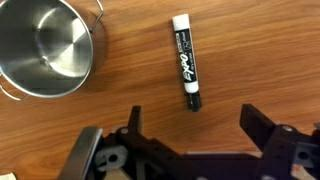
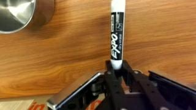
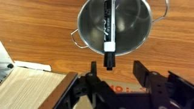
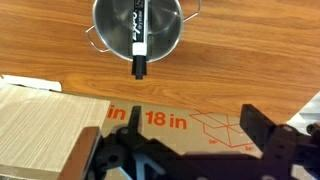

# Physical AI Robot Task Evaluator

**Real robot-manipulation evaluation using DROID episodes, robot telemetry, computer vision, and evidence reports.**

> **Real validation task:** `Put the marker in the pot` — DROID Episode 0, 166 robot steps.

## Real DROID demo

<p align="center">
  
  
  
  
</p>

| BEFORE | GRASP / LIFT | PLACE / RELEASE | AFTER |
|---|---|---|---|
| Robot approaches marker | Gripper holds marker and lifts | Marker reaches pot and release starts | Gripper withdraws |

**These image slots are for real frames extracted from the validated DROID episode — not AI-generated illustrations.**

## What this project does

The evaluator analyzes a robot manipulation episode as an ordered physical task:

`Approach → Grasp → Lift → Transport → Place → Release`

It combines robot state and visual evidence instead of treating a single object detector prediction as ground truth.

## How it works

```text
REAL DROID EPISODE
        │
        ├──────────────┐
        ▼              ▼
 Robot telemetry    RGB cameras
 gripper + pose     wrist + exterior
        │              │
        ▼              ▼
 Event detector     Visual reasoning
        │              │
        │              ├── Approach evidence
        │              └── Place evidence
        │
        ├── Grasp
        ├── Lift
        ├── Transport
        └── Release
        │
        └──────────┬───────────┘
                   ▼
          SIX-STAGE EVALUATOR
                   ▼
       SUCCESS / FAILURE / INCOMPLETE
                   ▼
          JSON + HTML REPORT
```

## Real Episode 0 evidence

| Stage | Validation | Evidence |
|---|---|---|
| Approach | PASS | targeted wrist-camera inspection |
| Grasp | PASS | automatic telemetry + visual evidence |
| Lift | PASS | automatic telemetry + visual evidence |
| Transport | PASS | automatic telemetry + visual evidence |
| Place | PASS | targeted wrist-camera inspection |
| Release | PASS | automatic telemetry + visual evidence |

### Automatically measured telemetry

| Event | Result |
|---|---:|
| Pickup low point | frame 62 |
| Grasp candidate | frame 66 |
| Lift detected | frame 80 |
| Release candidate | frame 139 |
| Lift rise at threshold | ~0.057 m |
| Grasp-to-release EE displacement | ~0.175 m |

**Human-validated Episode 0 result: `SUCCESS — 6/6`.**

The current automatic telemetry path establishes Grasp, Lift, Transport, and Release. Approach and Place are intentionally kept unknown in fully automatic mode until trustworthy object-relative visual evidence is available.

## Example evaluator output

```text
Task: Put the marker in the pot

APPROACH    PASS
GRASP       PASS     frame 66
LIFT        PASS     frame 80
TRANSPORT   PASS
PLACE       PASS
RELEASE     PASS     frame 139

Completion: 6/6
Result: SUCCESS

Validation:
REAL DROID + ROBOT TELEMETRY + VISUAL EVIDENCE
```

## Why this is a Physical AI project

The project works with **real embodied-agent data**, not only text or tabular data. It processes synchronized robot proprioception and RGB observations, detects temporal manipulation events, reasons over ordered physical stages, and produces reviewable evidence.

## Repository components

- `src/droid_adapter.py` — loads real DROID RLDS episodes.
- `src/droid_event_detector.py` — automatically detects telemetry events.
- `src/automatic_droid_evaluator.py` — automatic evidence-aware evaluator.
- `src/object_tracking.py` — YOLO detection + transparent tracking baseline.
- `src/role_identifier.py` — temporal gripper/object/target role reasoning.
- `src/action_stage_detector.py` — ordered six-stage inference.
- `src/report_generator.py` — JSON + HTML evidence reports.
- `evaluate_droid_automatic.py` — automatic DROID CLI.
- `docs/demo.md` — detailed real Episode 0 walkthrough.

## Run on DROID

```bash
python evaluate_droid_automatic.py /path/to/droid_100/1.0.0 --episode 0
```

Large DROID data and generated run directories are intentionally excluded from Git.

## Current limitation

Generic COCO YOLO did not reliably identify the marker or robot gripper in the real Episode 0 scene. The project therefore does **not** convert arbitrary COCO labels into fake robot-task roles. Fully automatic Approach and Place remain the main visual-perception milestone.

## Project status

**Working Physical AI portfolio prototype with real DROID validation.**

Completed: DROID loading, real frame/video extraction, robot telemetry decoding, automatic grasp/lift/transport/release detection, tracking baseline, six-stage evaluation core, JSON/HTML reporting, and real Episode 0 validation.

In progress: robust automatic object/gripper understanding, automatic Approach/Place evidence, multi-episode validation, and final demo/report polish.
